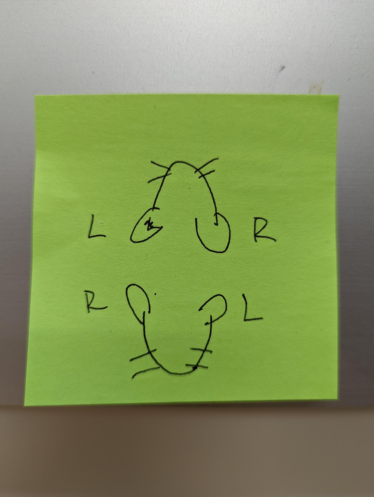
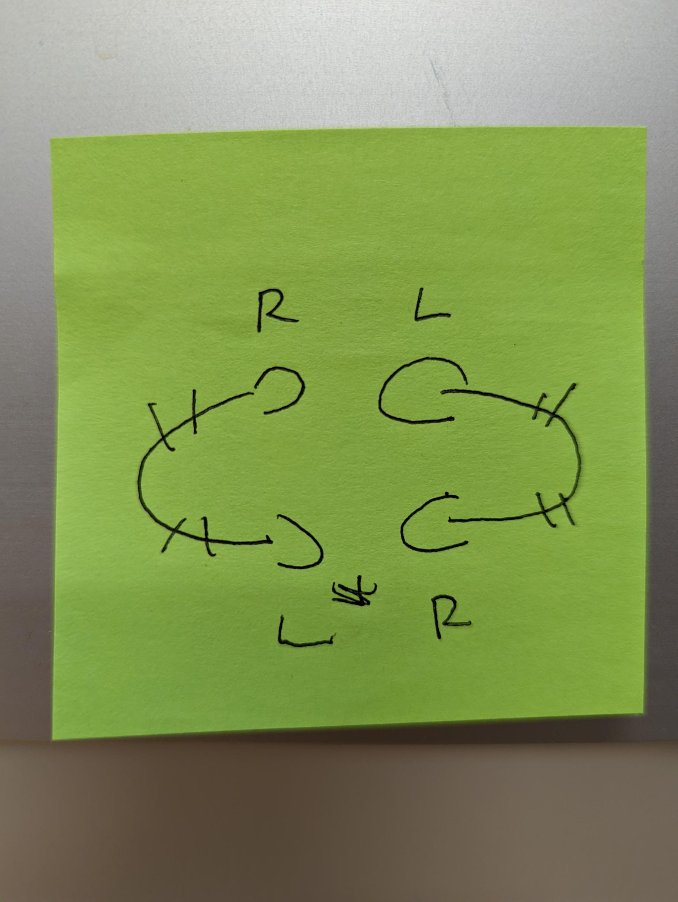
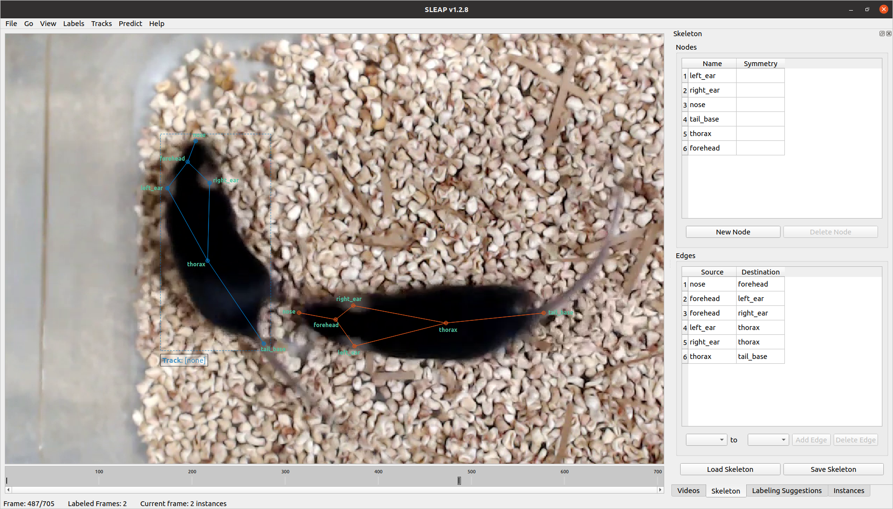

# Pose Labeling Guidelines 

## 1. Birds Eye View

- Associated file
    - [skewed_diamond.json](./skeletons/skewed_diamond.json)

- Body part locations:
    - nose: 
        - Tip of the nose
    - forehead: 
        - In the middle between the eyes
    - left ear: 
        - In the middle of the left ear
        - The left ear is the ear that's on the left side when the mouse is facing up or forward (away from you).
    - right ear:
        - In the middle of the right ear
        - The right ear is the ear that's on the right side when the mouse is facing up or forward (away from you).
        - Guide to which ear for different angles:
            - 
            -    
    - thorax:
        - In the middle of the midline from the nose to where the tail begins
    - tail base
        - The point where the tail comes out of the mouse's bodys. Make sure that the label is fully on the tail. 

- Skeleton structure:
    - nose -> forehead
    - forehead -> left_ear
    - forehead -> right_ear
    - left_ear -> thorax
    - right_ear -> thorax
    - thorax -> tail_base

- Related projects/protocols:
    - Reward Training
    - Reward Competition

- Example Labeling: 
    - 